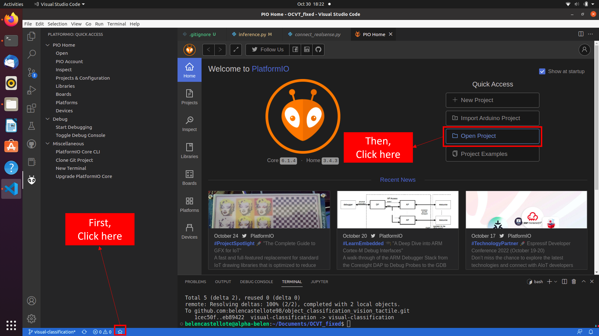
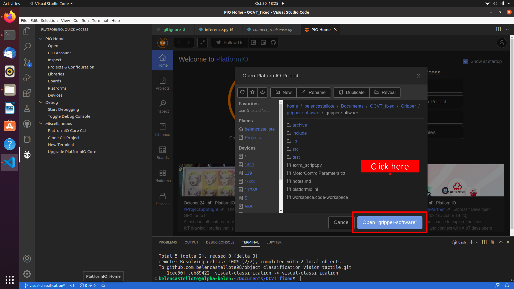
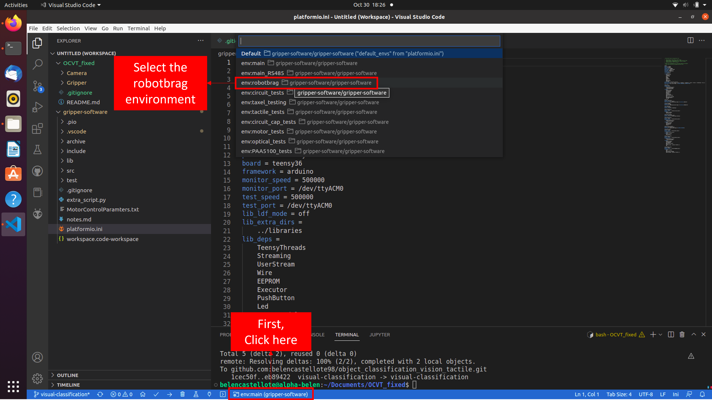
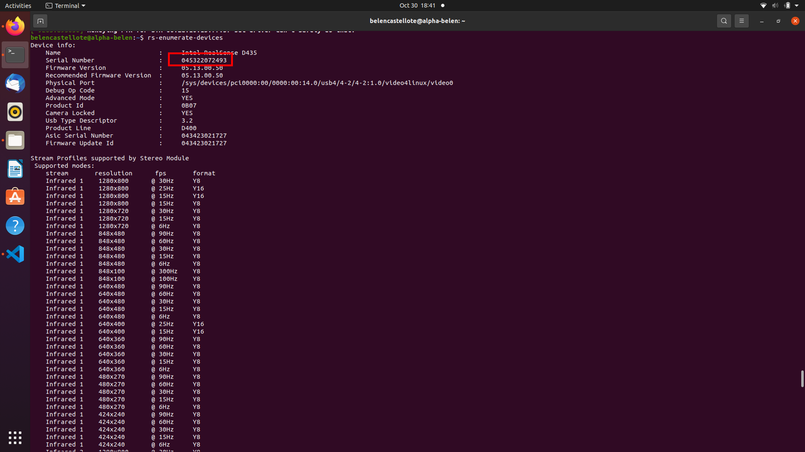

# VISUAL-TACTILE OBJECT CLASSIFICATION THROGH FASTER-RCNN (vision) AND MACHINE LEARNING (tactile)
This repository is made in order to simplify the setup of real-sense camera and gripper from Graspian at DTU. 

# Table of Contents

1. [Set up of the repository and libraries used](#set-up-of-the-repository-and-libraries-used)
2. [Set-up of Gripper from Graspian](#set-up-of-gripper-from-graspian)
3. [Set-up of Camera Realsense depth camera D435](#set-up-of-camera-realsense-depth-camera-d435)
4. [Train fasterrcnn_resnet50_fpn model from pytorch](#train-fasterrcnn_resnert50_fpn-model-from-pytorch)
5. [Object classification](#object-classification)


## Set up of the repository and libraries used
This project was run on Ubuntu 20.04. Everything was performed in Visual studio, except the training of the model of Faster-RCNNThe required libraries are inside the requirement file. To work with this repo, appart from the requirements.txt files, there are some requirements. Read through this file to understand all the software requirements.

First, clone the repository in the correct folder

```
cd $SELECTED_PATH
git clone https://github.com/belencastellote98/object_classification_vision_tactile.git
```
Once is cloned, download the correspondant libraries:
```
cd object_classification_vision_tactile
pip install -r requirements.txt
```
Now all the files and the correspondant python libraries will be downloaded into the computer. 

## Set-up of Gripper from Graspian
This code was developed by another master thesis student from DTU on Spring 2022. Click here to check the [repo](JACOBS LINK) 
In order to be able to work with this code, it is necessary to:
### Download Arduino 1.8.19 
[Web](https://www.arduino.cc/en/software). Click here to download the .exe file [link](https://downloads.arduino.cc/arduino-1.8.19-linux64.tar.xz) **Important: check supported versions of teensyduino before downloading arduino**
### Download Teensyduino
Follow the instructions provided [here](https://www.pjrc.com/teensy/td_download.html).
On the top right of the web there is a file called Linux udev rules. Copy it and save it as 00-teensy.rules. Then, go to the folder where it was saved and run this command:
```
sudo cp 00-teensy.rules /etc/udev/rules.d/
```
Download the .exe file for the teensyduino [link](https://www.pjrc.com/teensy/td_157/TeensyduinoInstall.linux64)
Run the installer by giving permission:
```
chmod 755 TeensyduinoInstall.linux64./TeensyduinoInstall.linux64
```
Once everything is correctly install, open Visual Studio Code, and add the extension for Platform IO. Once it is added, close the Visual Studio and reopen it. A new icon must have appeared on the left, a wasp. 

Click on the house icon in the bottom of the screen in VSC and select open project. 



Select the folder Gripper/gripper-software/gripper-software



For this project, it is necessary to work on the robotbrag environment. Follow the steps in the picture:



Once the usb cable is connected to the computer, click un upload. If it doesn't say succesful it is because some problem happened while uploading the code. **Check the cable connection and check that the user interface was not connected**
In case the user interface is required to be used, run:
```
cd Gripper/GraspianGripperSoftware/SamplerSoftware
python3 __main__.py
```
## Set-up of Camera Realsense depth camera D435
For this project, the camera will be used as a normal camera. In order to get the model work in real-time identification, it is necessary to install the pyrealsense library [see link](https://github.com/IntelRealSense/librealsense/tree/master/wrappers/python#installation)
```
pip install pyrealsense2
```
From now, it is necessary to check the device number of the camera:
```
rs-enumerate-devices
```


Open the connect_realsense.py, check the device number and if it is the same, run the code to check that the camera is correctly connected. If more help is needed, check on the examples given by the library [link](https://github.com/IntelRealSense/librealsense/tree/master/wrappers/python/examples)

## Train fasterrcnn_resnet50_fpn model from pytorch
The data was trained following the notebook given in the repo: [A Simple Pipeline to Train PyTorch FasterRCNN Model](https://github.com/sovit-123/fasterrcnn-pytorch-training-pipeline). That notebook is saved in this repo in Camera/results_camera/train_model
- Wandb: software to save the models. It is downloaded in .pth format.[link](https://wandb.ai/home)
- Roboflow: open dataset platform for object detection. See the used dataset for this project here [link](https://app.roboflow.com/ds/3llQvc8hux?key=vuPMmzDcdu)
After the dataset is trained it is saved into Wandb. 

## Object-classification

The main script is object_classifiction.py. Once everything is setup, dataset and models are needed. You can get them by yourself or you can take the data from this [link](https://dtudk-my.sharepoint.com/:f:/g/personal/s212759_dtu_dk/EsNGD-Rg7b5Av-D8nHts4_ABq6ukV6yzAHnAbH3TQ11lTw?e=junQXfN). It is possible to change the model of the Faster R-CNN  and the tactile-based algorithm in this script. 

In order to perform with the dataset, download the data from here. Remember to save the data of the tactile in the path Gripper/object_classification/Classifiers/. The path for the Faster R-CNN model is specified in the inference.py script (Camera/results_camera/).


